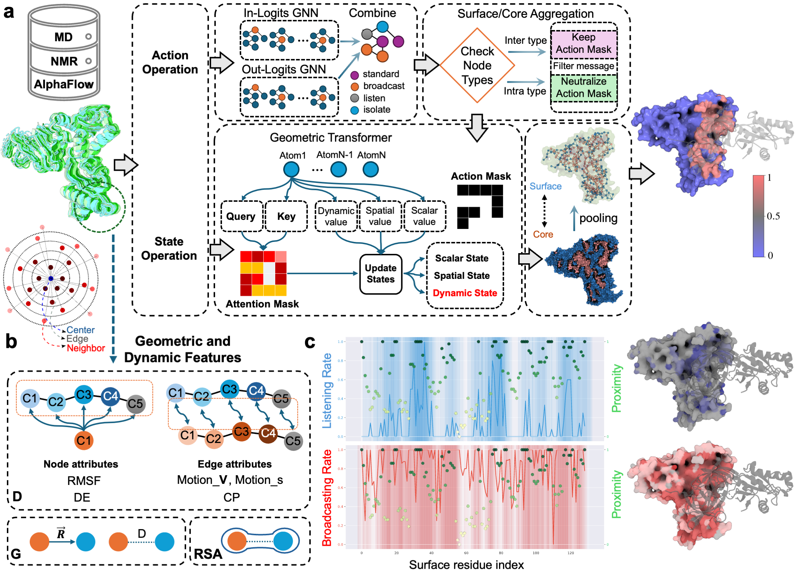

# DynamicGT
DynamicGT: a dynamic-aware geometric transformer model to predict protein binding interfaces in flexible and disordered regions
### Workflow explanations and figure+gif

<p align="center">
    
</p>

## **Installation**
```bash
git clone https://github.com/amisteromid/DynamicGT.git
conda env create -f env.yml
```
## **Training the model**
1. Zenodo link to clusters of MD and Aflow
2. How to run build_dataset.py with arguments and make h5 file
   The parameters of the script are:
   - ``--input``: path to the folder containing structures.
   - ``--output``: path/name of the h5 file to be saved.
   - ``--min-sequence-length``:  Minimum sequence length to process.
   - ``--num--workers``:  number of worker processes for data loading.
4. How to calculate the geo-dists for geoloss function (if Basic focalloss is not used)
5. Train the model

## **Running inference**
Download the model from [Google Drive](https://drive.google.com/file/d/1puehNHhu6JSjH-ZZetdNaVo6ftU-Oj1x/view?usp=sharing)
## **Citation**
Accompanying paper
